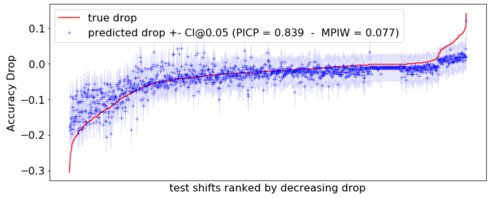

# Performance Prediction Under Dataset Shift



This repository is the official implementation of [Performance Prediction Under Dataset Shift](https://arxiv.org/abs/todo). 

## Requirements

To install requirements:

```setup
pip install -r requirements.txt
```

Datasets are stored via LFS in this github repository.

## Comparison of Performance Predictors

To run the benchmark in the paper, run this command:

```train
python run_benchmark.py 
```

This script will 1. generate training and test shifted datasets, 2. train several performance predictors models to compare, 3. produce paper figures.

## Results

Use the notebook [Performance Prediction Under Dataset Shift.ipynb](https://github.com/dataiku-research/performance_prediction_under_shift/blob/main/Performance%20Prediction%20Under%20Dataset%20Shift.ipynb) to load the results and generate the tables in the paper.

Use the notebook [Performance Prediction With Confidence Interval.ipynb](https://github.com/dataiku-research/performance_prediction_under_shift/blob/main/Performance%20Prediction%20With%20Confidence%20Interval.ipynb) to generate confidence intervals for performance predictions with the method proposed in the paper.

### MAE of Accuracy Prediction on Unseen Perturbations

| Dataset                       |   ATC  |ExpertRF (amazon) |ExpertRF (naver) |ErrorPredictorRF |
| ------------------------------|--------|------------------|-----------------|-----------------|
|adult                          |  0.031 |      0.013       |  0.012 |  0.001 |
|artificial_characters          |  0.056 |  0.046 |  0.051 |  0.010 |
|bank                           |  0.036 |  0.001 |  0.001 |  0.000 |
|bng_ionosphere                 |  0.131 |  0.217 |  0.132 |  0.050 |
|bng_zoo                        |  0.062 |  0.130 |  0.136 |  0.011 |
|default_of_credit_card_clients |  0.132 |  0.033 |  0.036 |  0.006 |
|heart                          |  0.071 |  0.029 |  0.032 |  0.004 |
|jsbach_chorals_modified        |  0.027 |  0.118 |  0.091 |  0.002 |
|SDSS                           |  0.090 |  0.108 |  0.141 |  0.023 |
|video_games                    |  0.039 |  0.010 |  0.010 |  0.002 |